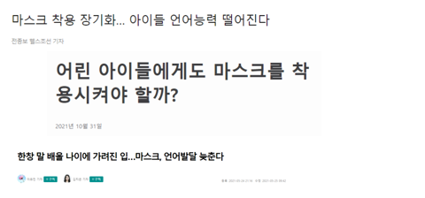
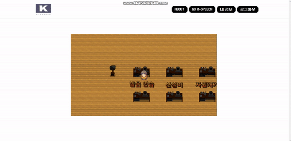
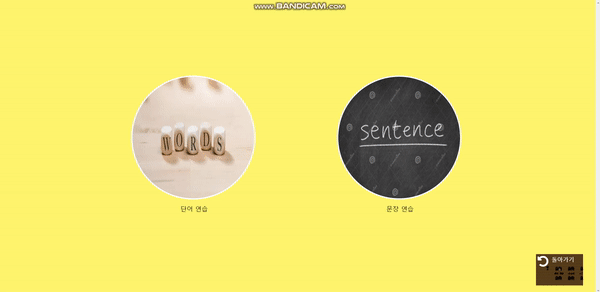
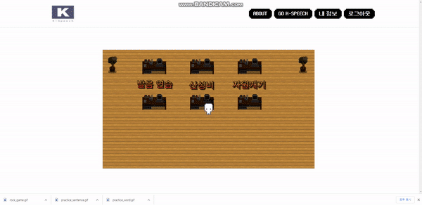
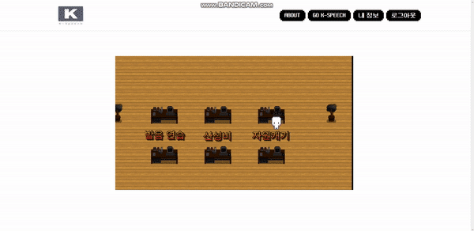
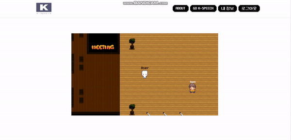

# K-Speech

# 👍기획의도

- 코로나 장기화로 마스크를 쓰고 지내는 시간이 길어지면서 최근 언어학습에 대한 문제가 증가 → 아이들의 경우 부모나 선생님의 입모양 표정등을 보고 글과 감정을 배우는데 마스크로 가려져있다..
  
    
    
- 최근 K-pop, K드라마 등 전세계 사람들이 한국어에 대한 관심이 많아지고 있는 추세다. 이는 외국인들의 한국어 능력시험 응시자의 증가를 통해 알 수 있다.
  
    
    

⇒ 아이들과 한국 문화를 좋아하는 외국인들이 이용할 수 있는 한국어 발음 연습 플랫폼을 제공

# ✡️기술스택

- Frontend : Vuejs, javascript, vuex, axios, webgl

- Backend : Springboot, JPA, QueryDSL

- Unity : Unity Hub , 2019.4.32f  unity

- Infra : docker, Jenkins, Nginx, Redis, Mysql, SpringCloud,Openvidu

  

# 💫아키텍처

# ☪️주요 기능

## 1. 메타버스

## 2. 발음 게임

## 3. 화상채팅

### GIT 규칙

- 작업단위로 브랜치 생성하여 작업하기

- 브랜치 구조 : master - develop(한개) - 기능별 브랜치 이름(역할 분배 된 대로)

- 브랜치명 규칙 : **jira-number_branchName (ex. S05P31D104-2_InitPage)**

- Merge 규칙 : 명세서 기반, 지라 기준 한개의 작업 또는 한개의 부작업 구현 완료시 Merge

  - **반드시 다른 사람에게 코드 리뷰를 받은 후 merge** 할 것

- Commit 규칙 : 수정 시 Modify 기능명, 추가 시 Add 기능명, 삭제시 Delete 기능명 등 앞에 확실히 알 수 있는 단어 붙이기 (ex. Feat : Add S05P31D104-2 초기화면 만들기 머시기~)

  - COMMIT END

    <타입> 리스트

    - feat : 기능 (새로운 기능)
    - fix : 버그 (버그 수정)
    - refactor: 리팩토링
    - build : 빌드 시스템 수정, 외부 종속 라이브러리 수정 (npm, gulp 등)
    - style : 스타일 (코드 형식, 세미콜론 추가: 비즈니스 로직에 변경 없음)
    - docs : 문서 (문서 추가, 수정, 삭제)
    - test : 테스트 (테스트 코드 추가, 수정, 삭제: 비즈니스 로직에 변경 없음)
    - perf : 성능 개선

  제목 첫 글자를 대문자로

  제목은 명령문으로

  제목 끝에 마침표(.) 금지

  제목과 본문을 한 줄 띄워 분리하기

  본문은 "어떻게" 보다 "무엇을", "왜"를 설명한다.

  본문에 여러줄의 메시지를 작성할 땐 "-"로 구분

# 멤버

- 강민주 : Backend ,Redis
- 배태호 : Frontend ,산성비 게임 개발
- 변준형 : Frontend , Redis
- 봉대현 : Unity , SSL 적용 ,openvidu
- 윤동현 : Spring Cloud , CI/CD , Docker